```python
### FITTING MULTI LINEAR REGRESSION MODEL FOR COVID DATASET
```


```python
## Modules required
import pandas as pd
import seaborn as sns
import numpy as np
import pylab
import math
import matplotlib.pyplot as plt
```


```python
from scipy import stats
import statsmodels.api as sm
from statsmodels.stats import diagnostic as diag
from statsmodels.stats.outliers_influence import variance_inflation_factor
from sklearn.linear_model import LinearRegression
from sklearn.metrics import mean_squared_error, r2_score, mean_absolute_error
%matplotlib inline
```


```python
 ## Load the dataset into pandas
covid19=pd.read_excel('covid19.xlsx')

```


```python
covid19.head()
```


<div>
<style scoped>
    .dataframe tbody tr th:only-of-type {
        vertical-align: middle;
    }

    .dataframe tbody tr th {
        vertical-align: top;
    }

    .dataframe thead th {
        text-align: right;
    }
</style>
<table border="1" class="dataframe">
  <thead>
    <tr style="text-align: right;">
      <th></th>
      <th>STATE</th>
      <th>STCD</th>
      <th>REGION</th>
      <th>CDHS</th>
      <th>HOSC</th>
      <th>ICU</th>
      <th>PLUF</th>
      <th>SINC</th>
      <th>POPD</th>
      <th>POPS</th>
      <th>...</th>
      <th>UNEM</th>
      <th>MEDA</th>
      <th>LEXP</th>
      <th>ADEP</th>
      <th>ATEM</th>
      <th>APRE</th>
      <th>CIGA</th>
      <th>OBES</th>
      <th>CNCS</th>
      <th>MRAT</th>
    </tr>
  </thead>
  <tbody>
    <tr>
      <th>0</th>
      <td>Alabama</td>
      <td>AL</td>
      <td>Southeast</td>
      <td>1265</td>
      <td>1547</td>
      <td>0</td>
      <td>16.8</td>
      <td>219230</td>
      <td>96.9221</td>
      <td>4908620</td>
      <td>...</td>
      <td>7.5</td>
      <td>20</td>
      <td>75.4</td>
      <td>63.1</td>
      <td>62.8</td>
      <td>58.3</td>
      <td>19.2</td>
      <td>36.2</td>
      <td>71813</td>
      <td>1.761520</td>
    </tr>
    <tr>
      <th>1</th>
      <td>Alaska</td>
      <td>AK</td>
      <td>West</td>
      <td>11</td>
      <td>34</td>
      <td>0</td>
      <td>11.1</td>
      <td>46099</td>
      <td>1.2863</td>
      <td>734002</td>
      <td>...</td>
      <td>12.4</td>
      <td>21</td>
      <td>78.3</td>
      <td>55.8</td>
      <td>26.6</td>
      <td>22.5</td>
      <td>19.1</td>
      <td>29.5</td>
      <td>2619</td>
      <td>0.420008</td>
    </tr>
    <tr>
      <th>2</th>
      <td>Arizona</td>
      <td>AZ</td>
      <td>Southwest</td>
      <td>2443</td>
      <td>3094</td>
      <td>870</td>
      <td>14.1</td>
      <td>346009</td>
      <td>64.9549</td>
      <td>7378490</td>
      <td>...</td>
      <td>10.0</td>
      <td>22</td>
      <td>79.5</td>
      <td>67.2</td>
      <td>60.3</td>
      <td>13.6</td>
      <td>14.0</td>
      <td>29.5</td>
      <td>150609</td>
      <td>1.622081</td>
    </tr>
    <tr>
      <th>3</th>
      <td>Arkansas</td>
      <td>AR</td>
      <td>Southeast</td>
      <td>362</td>
      <td>474</td>
      <td>0</td>
      <td>16.8</td>
      <td>137609</td>
      <td>58.4030</td>
      <td>3039000</td>
      <td>...</td>
      <td>8.0</td>
      <td>27</td>
      <td>76.0</td>
      <td>66.4</td>
      <td>60.4</td>
      <td>50.6</td>
      <td>22.7</td>
      <td>37.1</td>
      <td>35246</td>
      <td>1.027067</td>
    </tr>
    <tr>
      <th>4</th>
      <td>California</td>
      <td>CA</td>
      <td>West</td>
      <td>7100</td>
      <td>8820</td>
      <td>2284</td>
      <td>12.8</td>
      <td>2701899</td>
      <td>256.3728</td>
      <td>39937500</td>
      <td>...</td>
      <td>14.9</td>
      <td>26</td>
      <td>80.8</td>
      <td>58.1</td>
      <td>59.4</td>
      <td>22.2</td>
      <td>11.2</td>
      <td>25.8</td>
      <td>413576</td>
      <td>1.716734</td>
    </tr>
  </tbody>
</table>
<p>5 rows × 22 columns</p>
</div>


```python
## set the index equal to the year column
covid19.index = covid19['CDHS']
covid19 = covid19.drop(['STATE', 'STCD','REGION','CDHS'], axis = 1)
```


```python
covid19.head()
```


<div>
<style scoped>
    .dataframe tbody tr th:only-of-type {
        vertical-align: middle;
    }

    .dataframe tbody tr th {
        vertical-align: top;
    }

    .dataframe thead th {
        text-align: right;
    }
</style>
<table border="1" class="dataframe">
  <thead>
    <tr style="text-align: right;">
      <th></th>
      <th>HOSC</th>
      <th>ICU</th>
      <th>PLUF</th>
      <th>SINC</th>
      <th>POPD</th>
      <th>POPS</th>
      <th>HOML</th>
      <th>HUMI</th>
      <th>UNEM</th>
      <th>MEDA</th>
      <th>LEXP</th>
      <th>ADEP</th>
      <th>ATEM</th>
      <th>APRE</th>
      <th>CIGA</th>
      <th>OBES</th>
      <th>CNCS</th>
      <th>MRAT</th>
    </tr>
    <tr>
      <th>CDHS</th>
      <th></th>
      <th></th>
      <th></th>
      <th></th>
      <th></th>
      <th></th>
      <th></th>
      <th></th>
      <th></th>
      <th></th>
      <th></th>
      <th></th>
      <th></th>
      <th></th>
      <th></th>
      <th></th>
      <th></th>
      <th></th>
    </tr>
  </thead>
  <tbody>
    <tr>
      <th>1265</th>
      <td>1547</td>
      <td>0</td>
      <td>16.8</td>
      <td>219230</td>
      <td>96.9221</td>
      <td>4908620</td>
      <td>3261</td>
      <td>76.49</td>
      <td>7.5</td>
      <td>20</td>
      <td>75.4</td>
      <td>63.1</td>
      <td>62.8</td>
      <td>58.3</td>
      <td>19.2</td>
      <td>36.2</td>
      <td>71813</td>
      <td>1.761520</td>
    </tr>
    <tr>
      <th>11</th>
      <td>34</td>
      <td>0</td>
      <td>11.1</td>
      <td>46099</td>
      <td>1.2863</td>
      <td>734002</td>
      <td>1907</td>
      <td>81.46</td>
      <td>12.4</td>
      <td>21</td>
      <td>78.3</td>
      <td>55.8</td>
      <td>26.6</td>
      <td>22.5</td>
      <td>19.1</td>
      <td>29.5</td>
      <td>2619</td>
      <td>0.420008</td>
    </tr>
    <tr>
      <th>2443</th>
      <td>3094</td>
      <td>870</td>
      <td>14.1</td>
      <td>346009</td>
      <td>64.9549</td>
      <td>7378490</td>
      <td>10007</td>
      <td>79.40</td>
      <td>10.0</td>
      <td>22</td>
      <td>79.5</td>
      <td>67.2</td>
      <td>60.3</td>
      <td>13.6</td>
      <td>14.0</td>
      <td>29.5</td>
      <td>150609</td>
      <td>1.622081</td>
    </tr>
    <tr>
      <th>362</th>
      <td>474</td>
      <td>0</td>
      <td>16.8</td>
      <td>137609</td>
      <td>58.4030</td>
      <td>3039000</td>
      <td>2717</td>
      <td>76.92</td>
      <td>8.0</td>
      <td>27</td>
      <td>76.0</td>
      <td>66.4</td>
      <td>60.4</td>
      <td>50.6</td>
      <td>22.7</td>
      <td>37.1</td>
      <td>35246</td>
      <td>1.027067</td>
    </tr>
    <tr>
      <th>7100</th>
      <td>8820</td>
      <td>2284</td>
      <td>12.8</td>
      <td>2701899</td>
      <td>256.3728</td>
      <td>39937500</td>
      <td>151278</td>
      <td>80.36</td>
      <td>14.9</td>
      <td>26</td>
      <td>80.8</td>
      <td>58.1</td>
      <td>59.4</td>
      <td>22.2</td>
      <td>11.2</td>
      <td>25.8</td>
      <td>413576</td>
      <td>1.716734</td>
    </tr>
  </tbody>
</table>
</div>


```python
## Get the summary of our original data set
desc_covid19 = covid19.describe()
## Add the standard deviation metric
desc_covid19.loc['+3_std']=desc_covid19.loc['mean']+(desc_covid19.loc['std']*3)
desc_covid19.loc['-3_std']=desc_covid19.loc['mean']-(desc_covid19.loc['std']*3)
desc_covid19
```


<div>
<style scoped>
    .dataframe tbody tr th:only-of-type {
        vertical-align: middle;
    }

    .dataframe tbody tr th {
        vertical-align: top;
    }

    .dataframe thead th {
        text-align: right;
    }
</style>
<table border="1" class="dataframe">
  <thead>
    <tr style="text-align: right;">
      <th></th>
      <th>HOSC</th>
      <th>ICU</th>
      <th>PLUF</th>
      <th>SINC</th>
      <th>POPD</th>
      <th>POPS</th>
      <th>HOML</th>
      <th>HUMI</th>
      <th>UNEM</th>
      <th>MEDA</th>
      <th>LEXP</th>
      <th>ADEP</th>
      <th>ATEM</th>
      <th>APRE</th>
      <th>CIGA</th>
      <th>OBES</th>
      <th>CNCS</th>
      <th>MRAT</th>
    </tr>
  </thead>
  <tbody>
    <tr>
      <th>count</th>
      <td>54.000000</td>
      <td>54.000000</td>
      <td>54.000000</td>
      <td>5.400000e+01</td>
      <td>54.000000</td>
      <td>5.400000e+01</td>
      <td>54.000000</td>
      <td>54.000000</td>
      <td>54.000000</td>
      <td>54.000000</td>
      <td>54.000000</td>
      <td>54.000000</td>
      <td>54.000000</td>
      <td>54.000000</td>
      <td>54.000000</td>
      <td>54.000000</td>
      <td>54.000000</td>
      <td>54.000000</td>
    </tr>
    <tr>
      <th>mean</th>
      <td>1104.222222</td>
      <td>193.648148</td>
      <td>12.148148</td>
      <td>3.509831e+05</td>
      <td>188.797204</td>
      <td>6.122194e+06</td>
      <td>10290.055556</td>
      <td>73.259444</td>
      <td>9.285185</td>
      <td>19.407407</td>
      <td>72.857407</td>
      <td>57.701852</td>
      <td>48.096296</td>
      <td>34.237037</td>
      <td>15.553704</td>
      <td>30.716667</td>
      <td>73081.259259</td>
      <td>2.845177</td>
    </tr>
    <tr>
      <th>std</th>
      <td>2233.213293</td>
      <td>543.764695</td>
      <td>4.018483</td>
      <td>4.635854e+05</td>
      <td>262.712798</td>
      <td>7.401568e+06</td>
      <td>23642.778670</td>
      <td>18.085235</td>
      <td>3.764301</td>
      <td>7.196746</td>
      <td>20.864302</td>
      <td>16.789411</td>
      <td>16.082147</td>
      <td>17.526834</td>
      <td>4.954271</td>
      <td>5.704574</td>
      <td>100868.791513</td>
      <td>1.996974</td>
    </tr>
    <tr>
      <th>min</th>
      <td>0.000000</td>
      <td>0.000000</td>
      <td>0.000000</td>
      <td>0.000000e+00</td>
      <td>0.000000</td>
      <td>0.000000e+00</td>
      <td>0.000000</td>
      <td>0.000000</td>
      <td>0.000000</td>
      <td>0.000000</td>
      <td>0.000000</td>
      <td>0.000000</td>
      <td>0.000000</td>
      <td>0.000000</td>
      <td>0.000000</td>
      <td>0.000000</td>
      <td>38.000000</td>
      <td>0.420008</td>
    </tr>
    <tr>
      <th>25%</th>
      <td>64.000000</td>
      <td>0.000000</td>
      <td>10.625000</td>
      <td>7.769300e+04</td>
      <td>36.683350</td>
      <td>1.381610e+06</td>
      <td>1524.500000</td>
      <td>75.715000</td>
      <td>7.525000</td>
      <td>17.000000</td>
      <td>77.275000</td>
      <td>59.000000</td>
      <td>44.400000</td>
      <td>20.625000</td>
      <td>13.775000</td>
      <td>28.400000</td>
      <td>13226.500000</td>
      <td>1.412560</td>
    </tr>
    <tr>
      <th>50%</th>
      <td>403.500000</td>
      <td>13.000000</td>
      <td>12.350000</td>
      <td>2.097215e+05</td>
      <td>93.333700</td>
      <td>4.127955e+06</td>
      <td>4011.500000</td>
      <td>77.050000</td>
      <td>8.650000</td>
      <td>19.000000</td>
      <td>78.750000</td>
      <td>62.150000</td>
      <td>50.000000</td>
      <td>39.150000</td>
      <td>15.850000</td>
      <td>30.800000</td>
      <td>39225.000000</td>
      <td>1.986906</td>
    </tr>
    <tr>
      <th>75%</th>
      <td>1101.000000</td>
      <td>149.500000</td>
      <td>14.100000</td>
      <td>4.808068e+05</td>
      <td>218.398050</td>
      <td>7.278018e+06</td>
      <td>9201.000000</td>
      <td>79.392500</td>
      <td>11.200000</td>
      <td>22.000000</td>
      <td>79.875000</td>
      <td>64.225000</td>
      <td>57.100000</td>
      <td>47.850000</td>
      <td>18.975000</td>
      <td>34.250000</td>
      <td>82895.750000</td>
      <td>3.933966</td>
    </tr>
    <tr>
      <th>max</th>
      <td>10893.000000</td>
      <td>3281.000000</td>
      <td>19.800000</td>
      <td>2.701899e+06</td>
      <td>1215.198500</td>
      <td>3.993750e+07</td>
      <td>151278.000000</td>
      <td>82.010000</td>
      <td>17.400000</td>
      <td>48.000000</td>
      <td>82.300000</td>
      <td>69.700000</td>
      <td>70.700000</td>
      <td>63.700000</td>
      <td>23.400000</td>
      <td>39.500000</td>
      <td>413576.000000</td>
      <td>8.359082</td>
    </tr>
    <tr>
      <th>+3_std</th>
      <td>7803.862100</td>
      <td>1824.942234</td>
      <td>24.203597</td>
      <td>1.741739e+06</td>
      <td>976.935597</td>
      <td>2.832690e+07</td>
      <td>81218.391565</td>
      <td>127.515150</td>
      <td>20.578089</td>
      <td>40.997645</td>
      <td>135.450313</td>
      <td>108.070086</td>
      <td>96.342738</td>
      <td>86.817540</td>
      <td>30.416516</td>
      <td>47.830390</td>
      <td>375687.633798</td>
      <td>8.836098</td>
    </tr>
    <tr>
      <th>-3_std</th>
      <td>-5595.417655</td>
      <td>-1437.645937</td>
      <td>0.092700</td>
      <td>-1.039773e+06</td>
      <td>-599.341189</td>
      <td>-1.608251e+07</td>
      <td>-60638.280453</td>
      <td>19.003739</td>
      <td>-2.007719</td>
      <td>-2.182830</td>
      <td>10.264502</td>
      <td>7.333618</td>
      <td>-0.150145</td>
      <td>-18.343466</td>
      <td>0.690892</td>
      <td>13.602943</td>
      <td>-229525.115280</td>
      <td>-3.145745</td>
    </tr>
  </tbody>
</table>
</div>


```python
## Data preprocessing ##
## How is the distribution of the dependent variables?
```


```python
## Condisder CNCS 
CNCS = covid19.CNCS 
pd.Series(CNCS).hist()
plt.show()
stats.probplot(CNCS, dist="norm", plot=pylab)
pylab.show()
```


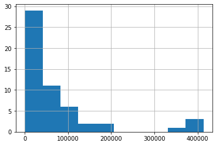


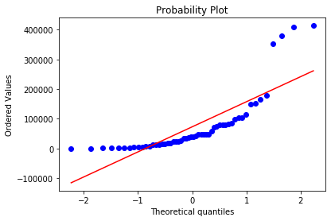


```python
## Performing data transformation on this variable for normality
CNCS_bc, lmda = stats.boxcox(CNCS)
pd.Series(CNCS_bc).hist()
plt.show()
stats.probplot(CNCS_bc, dist = "norm", plot=pylab)
pylab.show()
print("lambda parameter for Box-Cox Transformation is {}".format(lmda))
```


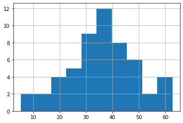


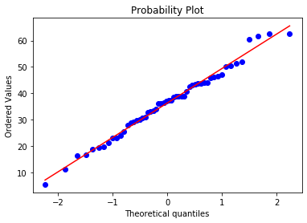


    lambda parameter for Box-Cox Transformation is 0.20232519582590952
    


```python
## Condisder MRAT 
MRAT = covid19.MRAT 
pd.Series(MRAT).hist()
plt.show()
stats.probplot(MRAT, dist="norm", plot=pylab)
pylab.show()
```


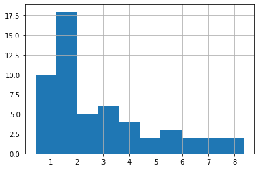


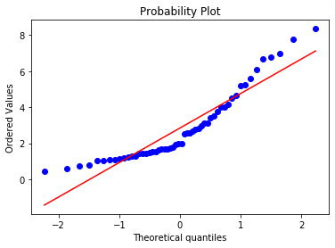


```python
## Performing data transformation on this variable for normality
MRAT_bc, lmda = stats.boxcox(MRAT)
pd.Series(MRAT_bc).hist()
plt.show()
stats.probplot(MRAT_bc, dist = "norm", plot=pylab)
pylab.show()
print("lambda parameter for Box-Cox Transformation is {}".format(lmda))
```


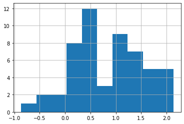


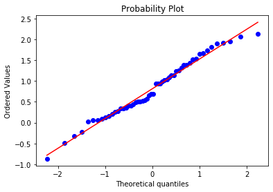


    lambda parameter for Box-Cox Transformation is 0.003882782809026342
    


```python
covid19["MRAT"] = MRAT_bc
covid19["CNCS"] = CNCS_bc
```


```python
## Checking the Model Assumptions
######## Multicolinearity #################
## printing out correlation matrix of the data frame
corr=covid19.corr()
## Display the correlation matrix
display(corr)
```


<div>
<style scoped>
    .dataframe tbody tr th:only-of-type {
        vertical-align: middle;
    }

    .dataframe tbody tr th {
        vertical-align: top;
    }

    .dataframe thead th {
        text-align: right;
    }
</style>
<table border="1" class="dataframe">
  <thead>
    <tr style="text-align: right;">
      <th></th>
      <th>HOSC</th>
      <th>ICU</th>
      <th>PLUF</th>
      <th>SINC</th>
      <th>POPD</th>
      <th>POPS</th>
      <th>HOML</th>
      <th>HUMI</th>
      <th>UNEM</th>
      <th>MEDA</th>
      <th>LEXP</th>
      <th>ADEP</th>
      <th>ATEM</th>
      <th>APRE</th>
      <th>CIGA</th>
      <th>OBES</th>
      <th>CNCS</th>
      <th>MRAT</th>
    </tr>
  </thead>
  <tbody>
    <tr>
      <th>HOSC</th>
      <td>1.000000</td>
      <td>0.783354</td>
      <td>0.214592</td>
      <td>0.778834</td>
      <td>0.069699</td>
      <td>0.846651</td>
      <td>0.555732</td>
      <td>0.098759</td>
      <td>0.157446</td>
      <td>0.056074</td>
      <td>0.124298</td>
      <td>0.118983</td>
      <td>0.378562</td>
      <td>0.217130</td>
      <td>0.067580</td>
      <td>0.080038</td>
      <td>0.635924</td>
      <td>-0.208674</td>
    </tr>
    <tr>
      <th>ICU</th>
      <td>0.783354</td>
      <td>1.000000</td>
      <td>0.138199</td>
      <td>0.719634</td>
      <td>-0.007543</td>
      <td>0.753193</td>
      <td>0.548475</td>
      <td>0.084027</td>
      <td>0.147211</td>
      <td>0.045335</td>
      <td>0.097515</td>
      <td>0.073675</td>
      <td>0.228042</td>
      <td>0.072459</td>
      <td>0.078908</td>
      <td>0.048655</td>
      <td>0.471339</td>
      <td>-0.138535</td>
    </tr>
    <tr>
      <th>PLUF</th>
      <td>0.214592</td>
      <td>0.138199</td>
      <td>1.000000</td>
      <td>0.144771</td>
      <td>-0.043094</td>
      <td>0.200162</td>
      <td>0.078809</td>
      <td>0.714648</td>
      <td>0.345506</td>
      <td>0.357682</td>
      <td>0.533521</td>
      <td>0.607745</td>
      <td>0.667526</td>
      <td>0.437666</td>
      <td>0.438371</td>
      <td>0.587960</td>
      <td>0.408797</td>
      <td>-0.090166</td>
    </tr>
    <tr>
      <th>SINC</th>
      <td>0.778834</td>
      <td>0.719634</td>
      <td>0.144771</td>
      <td>1.000000</td>
      <td>0.254539</td>
      <td>0.984750</td>
      <td>0.889213</td>
      <td>0.175348</td>
      <td>0.432327</td>
      <td>0.107861</td>
      <td>0.222027</td>
      <td>0.148435</td>
      <td>0.319816</td>
      <td>0.214580</td>
      <td>0.003127</td>
      <td>-0.035069</td>
      <td>0.762188</td>
      <td>0.037871</td>
    </tr>
    <tr>
      <th>POPD</th>
      <td>0.069699</td>
      <td>-0.007543</td>
      <td>-0.043094</td>
      <td>0.254539</td>
      <td>1.000000</td>
      <td>0.209218</td>
      <td>0.153910</td>
      <td>0.112114</td>
      <td>0.537803</td>
      <td>0.079143</td>
      <td>0.226472</td>
      <td>0.120808</td>
      <td>0.231584</td>
      <td>0.423055</td>
      <td>-0.152823</td>
      <td>-0.131573</td>
      <td>0.384925</td>
      <td>0.520542</td>
    </tr>
    <tr>
      <th>POPS</th>
      <td>0.846651</td>
      <td>0.753193</td>
      <td>0.200162</td>
      <td>0.984750</td>
      <td>0.209218</td>
      <td>1.000000</td>
      <td>0.818138</td>
      <td>0.189892</td>
      <td>0.392972</td>
      <td>0.091591</td>
      <td>0.245149</td>
      <td>0.189620</td>
      <td>0.382708</td>
      <td>0.260359</td>
      <td>0.074792</td>
      <td>0.032612</td>
      <td>0.793436</td>
      <td>-0.014079</td>
    </tr>
    <tr>
      <th>HOML</th>
      <td>0.555732</td>
      <td>0.548475</td>
      <td>0.078809</td>
      <td>0.889213</td>
      <td>0.153910</td>
      <td>0.818138</td>
      <td>1.000000</td>
      <td>0.111731</td>
      <td>0.390642</td>
      <td>0.174102</td>
      <td>0.144839</td>
      <td>0.066961</td>
      <td>0.174210</td>
      <td>0.038462</td>
      <td>-0.105630</td>
      <td>-0.133165</td>
      <td>0.544864</td>
      <td>-0.019613</td>
    </tr>
    <tr>
      <th>HUMI</th>
      <td>0.098759</td>
      <td>0.084027</td>
      <td>0.714648</td>
      <td>0.175348</td>
      <td>0.112114</td>
      <td>0.189892</td>
      <td>0.111731</td>
      <td>1.000000</td>
      <td>0.570755</td>
      <td>0.100406</td>
      <td>0.850670</td>
      <td>0.835359</td>
      <td>0.692897</td>
      <td>0.424430</td>
      <td>0.408857</td>
      <td>0.409182</td>
      <td>0.362717</td>
      <td>-0.026401</td>
    </tr>
    <tr>
      <th>UNEM</th>
      <td>0.157446</td>
      <td>0.147211</td>
      <td>0.345506</td>
      <td>0.432327</td>
      <td>0.537803</td>
      <td>0.392972</td>
      <td>0.390642</td>
      <td>0.570755</td>
      <td>1.000000</td>
      <td>0.203597</td>
      <td>0.559182</td>
      <td>0.451502</td>
      <td>0.449188</td>
      <td>0.372698</td>
      <td>0.080647</td>
      <td>0.049998</td>
      <td>0.486544</td>
      <td>0.335970</td>
    </tr>
    <tr>
      <th>MEDA</th>
      <td>0.056074</td>
      <td>0.045335</td>
      <td>0.357682</td>
      <td>0.107861</td>
      <td>0.079143</td>
      <td>0.091591</td>
      <td>0.174102</td>
      <td>0.100406</td>
      <td>0.203597</td>
      <td>1.000000</td>
      <td>0.002128</td>
      <td>0.000806</td>
      <td>0.075851</td>
      <td>0.024963</td>
      <td>-0.223571</td>
      <td>0.349345</td>
      <td>0.256325</td>
      <td>0.077939</td>
    </tr>
    <tr>
      <th>LEXP</th>
      <td>0.124298</td>
      <td>0.097515</td>
      <td>0.533521</td>
      <td>0.222027</td>
      <td>0.226472</td>
      <td>0.245149</td>
      <td>0.144839</td>
      <td>0.850670</td>
      <td>0.559182</td>
      <td>0.002128</td>
      <td>1.000000</td>
      <td>0.974623</td>
      <td>0.836424</td>
      <td>0.541184</td>
      <td>0.548143</td>
      <td>0.401819</td>
      <td>0.397745</td>
      <td>-0.077010</td>
    </tr>
    <tr>
      <th>ADEP</th>
      <td>0.118983</td>
      <td>0.073675</td>
      <td>0.607745</td>
      <td>0.148435</td>
      <td>0.120808</td>
      <td>0.189620</td>
      <td>0.066961</td>
      <td>0.835359</td>
      <td>0.451502</td>
      <td>0.000806</td>
      <td>0.974623</td>
      <td>1.000000</td>
      <td>0.862541</td>
      <td>0.535564</td>
      <td>0.606851</td>
      <td>0.481516</td>
      <td>0.367409</td>
      <td>-0.172075</td>
    </tr>
    <tr>
      <th>ATEM</th>
      <td>0.378562</td>
      <td>0.228042</td>
      <td>0.667526</td>
      <td>0.319816</td>
      <td>0.231584</td>
      <td>0.382708</td>
      <td>0.174210</td>
      <td>0.692897</td>
      <td>0.449188</td>
      <td>0.075851</td>
      <td>0.836424</td>
      <td>0.862541</td>
      <td>1.000000</td>
      <td>0.719510</td>
      <td>0.526240</td>
      <td>0.491363</td>
      <td>0.564046</td>
      <td>-0.121170</td>
    </tr>
    <tr>
      <th>APRE</th>
      <td>0.217130</td>
      <td>0.072459</td>
      <td>0.437666</td>
      <td>0.214580</td>
      <td>0.423055</td>
      <td>0.260359</td>
      <td>0.038462</td>
      <td>0.424430</td>
      <td>0.372698</td>
      <td>0.024963</td>
      <td>0.541184</td>
      <td>0.535564</td>
      <td>0.719510</td>
      <td>1.000000</td>
      <td>0.406380</td>
      <td>0.394081</td>
      <td>0.460241</td>
      <td>0.091112</td>
    </tr>
    <tr>
      <th>CIGA</th>
      <td>0.067580</td>
      <td>0.078908</td>
      <td>0.438371</td>
      <td>0.003127</td>
      <td>-0.152823</td>
      <td>0.074792</td>
      <td>-0.105630</td>
      <td>0.408857</td>
      <td>0.080647</td>
      <td>-0.223571</td>
      <td>0.548143</td>
      <td>0.606851</td>
      <td>0.526240</td>
      <td>0.406380</td>
      <td>1.000000</td>
      <td>0.627732</td>
      <td>0.154747</td>
      <td>-0.277375</td>
    </tr>
    <tr>
      <th>OBES</th>
      <td>0.080038</td>
      <td>0.048655</td>
      <td>0.587960</td>
      <td>-0.035069</td>
      <td>-0.131573</td>
      <td>0.032612</td>
      <td>-0.133165</td>
      <td>0.409182</td>
      <td>0.049998</td>
      <td>0.349345</td>
      <td>0.401819</td>
      <td>0.481516</td>
      <td>0.491363</td>
      <td>0.394081</td>
      <td>0.627732</td>
      <td>1.000000</td>
      <td>0.286058</td>
      <td>-0.250750</td>
    </tr>
    <tr>
      <th>CNCS</th>
      <td>0.635924</td>
      <td>0.471339</td>
      <td>0.408797</td>
      <td>0.762188</td>
      <td>0.384925</td>
      <td>0.793436</td>
      <td>0.544864</td>
      <td>0.362717</td>
      <td>0.486544</td>
      <td>0.256325</td>
      <td>0.397745</td>
      <td>0.367409</td>
      <td>0.564046</td>
      <td>0.460241</td>
      <td>0.154747</td>
      <td>0.286058</td>
      <td>1.000000</td>
      <td>0.076969</td>
    </tr>
    <tr>
      <th>MRAT</th>
      <td>-0.208674</td>
      <td>-0.138535</td>
      <td>-0.090166</td>
      <td>0.037871</td>
      <td>0.520542</td>
      <td>-0.014079</td>
      <td>-0.019613</td>
      <td>-0.026401</td>
      <td>0.335970</td>
      <td>0.077939</td>
      <td>-0.077010</td>
      <td>-0.172075</td>
      <td>-0.121170</td>
      <td>0.091112</td>
      <td>-0.277375</td>
      <td>-0.250750</td>
      <td>0.076969</td>
      <td>1.000000</td>
    </tr>
  </tbody>
</table>
</div>


```python
## plot a heatmap
sns.heatmap(corr, xticklabels = corr.columns, yticklabels = corr.columns, cmap="RdBu")
```


    <matplotlib.axes._subplots.AxesSubplot at 0x24f6befb7c8>


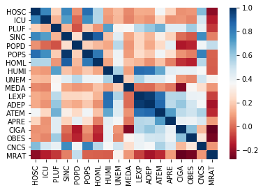


```python
### Using the VIF to measure to detect the above and dropping all variable with greater than 10 VIF
covid19_before = covid19
covid19_after = covid19.drop(['SINC','POPS','HOML','LEXP','HOSC'], axis = 1)
x1 = sm.tools.add_constant(covid19_before)
x2 = sm.tools.add_constant(covid19_after)

#Create a series for both
series_before = pd.Series([variance_inflation_factor(x1.values, i) for i in range(x1.shape[1])], index = x1.columns)
series_after = pd.Series([variance_inflation_factor(x2.values, i) for i in range(x2.shape[1])], index = x2.columns)

## dispay the series
print('DATA BEFORE')
print('-'*100)
display(series_before)

print('DATA AFTER')
print('-'*100)
display(series_after)
```

    DATA BEFORE
    ----------------------------------------------------------------------------------------------------
    


    const     55.162561
    HOSC      10.124455
    ICU        3.527610
    PLUF       7.779758
    SINC     333.587585
    POPD       3.405971
    POPS     253.498730
    HOML      23.741745
    HUMI      12.113615
    UNEM       3.217367
    MEDA       2.885858
    LEXP      68.271441
    ADEP      56.743280
    ATEM      13.095885
    APRE       3.135952
    CIGA       4.354244
    OBES       3.902259
    CNCS       6.506840
    MRAT       2.262323
    dtype: float64


    DATA AFTER
    ----------------------------------------------------------------------------------------------------
    


    const    49.460115
    ICU       1.541582
    PLUF      4.319143
    POPD      2.567941
    HUMI      7.396901
    UNEM      2.789414
    MEDA      2.493145
    ADEP     12.665588
    ATEM     10.440902
    APRE      2.935465
    CIGA      3.911578
    OBES      3.469457
    CNCS      2.431905
    MRAT      1.704872
    dtype: float64


```python
covid19_after
```


<div>
<style scoped>
    .dataframe tbody tr th:only-of-type {
        vertical-align: middle;
    }

    .dataframe tbody tr th {
        vertical-align: top;
    }

    .dataframe thead th {
        text-align: right;
    }
</style>
<table border="1" class="dataframe">
  <thead>
    <tr style="text-align: right;">
      <th></th>
      <th>ICU</th>
      <th>PLUF</th>
      <th>POPD</th>
      <th>HUMI</th>
      <th>UNEM</th>
      <th>MEDA</th>
      <th>ADEP</th>
      <th>ATEM</th>
      <th>APRE</th>
      <th>CIGA</th>
      <th>OBES</th>
      <th>CNCS</th>
      <th>MRAT</th>
    </tr>
    <tr>
      <th>CDHS</th>
      <th></th>
      <th></th>
      <th></th>
      <th></th>
      <th></th>
      <th></th>
      <th></th>
      <th></th>
      <th></th>
      <th></th>
      <th></th>
      <th></th>
      <th></th>
    </tr>
  </thead>
  <tbody>
    <tr>
      <th>1265</th>
      <td>0</td>
      <td>16.8</td>
      <td>96.9221</td>
      <td>76.49</td>
      <td>7.5</td>
      <td>20</td>
      <td>63.1</td>
      <td>62.8</td>
      <td>58.3</td>
      <td>19.2</td>
      <td>36.2</td>
      <td>42.534352</td>
      <td>0.566800</td>
    </tr>
    <tr>
      <th>11</th>
      <td>0</td>
      <td>11.1</td>
      <td>1.2863</td>
      <td>81.46</td>
      <td>12.4</td>
      <td>21</td>
      <td>55.8</td>
      <td>26.6</td>
      <td>22.5</td>
      <td>19.1</td>
      <td>29.5</td>
      <td>19.352913</td>
      <td>-0.866023</td>
    </tr>
    <tr>
      <th>2443</th>
      <td>870</td>
      <td>14.1</td>
      <td>64.9549</td>
      <td>79.40</td>
      <td>10.0</td>
      <td>22</td>
      <td>67.2</td>
      <td>60.3</td>
      <td>13.6</td>
      <td>14.0</td>
      <td>29.5</td>
      <td>50.209267</td>
      <td>0.484164</td>
    </tr>
    <tr>
      <th>362</th>
      <td>0</td>
      <td>16.8</td>
      <td>58.4030</td>
      <td>76.92</td>
      <td>8.0</td>
      <td>27</td>
      <td>66.4</td>
      <td>60.4</td>
      <td>50.6</td>
      <td>22.7</td>
      <td>37.1</td>
      <td>36.167220</td>
      <td>0.026708</td>
    </tr>
    <tr>
      <th>7100</th>
      <td>2284</td>
      <td>12.8</td>
      <td>256.3728</td>
      <td>80.36</td>
      <td>14.9</td>
      <td>26</td>
      <td>58.1</td>
      <td>59.4</td>
      <td>22.2</td>
      <td>11.2</td>
      <td>25.8</td>
      <td>62.715700</td>
      <td>0.540991</td>
    </tr>
    <tr>
      <th>1643</th>
      <td>0</td>
      <td>9.7</td>
      <td>56.4012</td>
      <td>79.71</td>
      <td>10.5</td>
      <td>18</td>
      <td>56.7</td>
      <td>45.1</td>
      <td>15.9</td>
      <td>14.5</td>
      <td>23.0</td>
      <td>37.456771</td>
      <td>1.390424</td>
    </tr>
    <tr>
      <th>4031</th>
      <td>0</td>
      <td>10.3</td>
      <td>735.8695</td>
      <td>79.34</td>
      <td>9.8</td>
      <td>21</td>
      <td>59.8</td>
      <td>49.0</td>
      <td>50.3</td>
      <td>12.2</td>
      <td>27.4</td>
      <td>38.859101</td>
      <td>2.132126</td>
    </tr>
    <tr>
      <th>517</th>
      <td>7</td>
      <td>12.2</td>
      <td>504.3073</td>
      <td>72.02</td>
      <td>12.5</td>
      <td>21</td>
      <td>64.0</td>
      <td>55.3</td>
      <td>45.7</td>
      <td>16.5</td>
      <td>33.5</td>
      <td>29.059185</td>
      <td>1.324765</td>
    </tr>
    <tr>
      <th>644</th>
      <td>18</td>
      <td>16.1</td>
      <td>0.0000</td>
      <td>77.41</td>
      <td>8.6</td>
      <td>28</td>
      <td>0.0</td>
      <td>0.0</td>
      <td>0.0</td>
      <td>0.0</td>
      <td>24.7</td>
      <td>27.848323</td>
      <td>1.726006</td>
    </tr>
    <tr>
      <th>4341</th>
      <td>0</td>
      <td>13.7</td>
      <td>410.1259</td>
      <td>77.05</td>
      <td>10.4</td>
      <td>18</td>
      <td>66.3</td>
      <td>70.7</td>
      <td>54.5</td>
      <td>14.5</td>
      <td>30.7</td>
      <td>61.553029</td>
      <td>0.134142</td>
    </tr>
    <tr>
      <th>2547</th>
      <td>0</td>
      <td>14.5</td>
      <td>186.6726</td>
      <td>75.76</td>
      <td>7.6</td>
      <td>17</td>
      <td>59.8</td>
      <td>63.5</td>
      <td>50.7</td>
      <td>16.1</td>
      <td>32.5</td>
      <td>50.334143</td>
      <td>0.514735</td>
    </tr>
    <tr>
      <th>5</th>
      <td>0</td>
      <td>0.0</td>
      <td>0.0000</td>
      <td>0.00</td>
      <td>0.0</td>
      <td>0</td>
      <td>0.0</td>
      <td>0.0</td>
      <td>0.0</td>
      <td>21.9</td>
      <td>29.8</td>
      <td>11.034963</td>
      <td>0.415851</td>
    </tr>
    <tr>
      <th>20</th>
      <td>0</td>
      <td>9.0</td>
      <td>219.9424</td>
      <td>74.64</td>
      <td>13.9</td>
      <td>17</td>
      <td>63.5</td>
      <td>70.0</td>
      <td>63.7</td>
      <td>13.4</td>
      <td>24.9</td>
      <td>16.516663</td>
      <td>0.344129</td>
    </tr>
    <tr>
      <th>114</th>
      <td>46</td>
      <td>11.7</td>
      <td>22.0970</td>
      <td>79.51</td>
      <td>5.6</td>
      <td>17</td>
      <td>69.7</td>
      <td>44.4</td>
      <td>18.9</td>
      <td>14.7</td>
      <td>28.4</td>
      <td>30.017058</td>
      <td>-0.327580</td>
    </tr>
    <tr>
      <th>6652</th>
      <td>337</td>
      <td>12.1</td>
      <td>228.0246</td>
      <td>76.94</td>
      <td>14.6</td>
      <td>17</td>
      <td>60.3</td>
      <td>51.8</td>
      <td>39.2</td>
      <td>15.5</td>
      <td>31.8</td>
      <td>51.338360</td>
      <td>1.388969</td>
    </tr>
    <tr>
      <th>2733</th>
      <td>327</td>
      <td>13.0</td>
      <td>188.2809</td>
      <td>75.86</td>
      <td>11.2</td>
      <td>18</td>
      <td>63.2</td>
      <td>51.7</td>
      <td>41.7</td>
      <td>21.1</td>
      <td>34.1</td>
      <td>40.632311</td>
      <td>1.543195</td>
    </tr>
    <tr>
      <th>794</th>
      <td>71</td>
      <td>11.2</td>
      <td>56.9284</td>
      <td>82.01</td>
      <td>8.0</td>
      <td>19</td>
      <td>65.8</td>
      <td>47.8</td>
      <td>34.0</td>
      <td>16.6</td>
      <td>35.3</td>
      <td>37.188952</td>
      <td>0.691735</td>
    </tr>
    <tr>
      <th>315</th>
      <td>112</td>
      <td>11.9</td>
      <td>35.5968</td>
      <td>79.37</td>
      <td>7.5</td>
      <td>14</td>
      <td>65.7</td>
      <td>54.3</td>
      <td>28.9</td>
      <td>17.2</td>
      <td>34.4</td>
      <td>33.125200</td>
      <td>0.267749</td>
    </tr>
    <tr>
      <th>656</th>
      <td>145</td>
      <td>16.7</td>
      <td>113.9566</td>
      <td>76.42</td>
      <td>4.3</td>
      <td>26</td>
      <td>62.2</td>
      <td>55.6</td>
      <td>48.9</td>
      <td>23.4</td>
      <td>36.6</td>
      <td>33.263522</td>
      <td>0.985151</td>
    </tr>
    <tr>
      <th>3090</th>
      <td>0</td>
      <td>18.7</td>
      <td>107.5174</td>
      <td>75.71</td>
      <td>9.7</td>
      <td>29</td>
      <td>62.0</td>
      <td>66.4</td>
      <td>60.1</td>
      <td>20.5</td>
      <td>36.8</td>
      <td>45.757296</td>
      <td>1.137155</td>
    </tr>
    <tr>
      <th>130</th>
      <td>8</td>
      <td>11.6</td>
      <td>43.6336</td>
      <td>80.76</td>
      <td>6.6</td>
      <td>18</td>
      <td>62.7</td>
      <td>41.0</td>
      <td>2.2</td>
      <td>17.8</td>
      <td>30.4</td>
      <td>21.144914</td>
      <td>1.253460</td>
    </tr>
    <tr>
      <th>3622</th>
      <td>137</td>
      <td>9.1</td>
      <td>626.6735</td>
      <td>74.35</td>
      <td>8.0</td>
      <td>19</td>
      <td>58.7</td>
      <td>54.2</td>
      <td>44.5</td>
      <td>12.5</td>
      <td>30.9</td>
      <td>43.603902</td>
      <td>1.512446</td>
    </tr>
    <tr>
      <th>7753</th>
      <td>63</td>
      <td>10.0</td>
      <td>894.4359</td>
      <td>75.08</td>
      <td>17.4</td>
      <td>23</td>
      <td>56.2</td>
      <td>47.9</td>
      <td>47.7</td>
      <td>13.4</td>
      <td>25.7</td>
      <td>47.217224</td>
      <td>1.921380</td>
    </tr>
    <tr>
      <th>5596</th>
      <td>210</td>
      <td>14.0</td>
      <td>177.6650</td>
      <td>74.78</td>
      <td>14.8</td>
      <td>22</td>
      <td>62.2</td>
      <td>44.4</td>
      <td>32.8</td>
      <td>18.9</td>
      <td>33.0</td>
      <td>44.032289</td>
      <td>1.906648</td>
    </tr>
    <tr>
      <th>1484</th>
      <td>119</td>
      <td>9.6</td>
      <td>71.5922</td>
      <td>80.61</td>
      <td>8.6</td>
      <td>18</td>
      <td>62.3</td>
      <td>41.2</td>
      <td>27.3</td>
      <td>15.7</td>
      <td>30.1</td>
      <td>38.810847</td>
      <td>1.132004</td>
    </tr>
    <tr>
      <th>1206</th>
      <td>293</td>
      <td>19.8</td>
      <td>63.7056</td>
      <td>75.73</td>
      <td>8.7</td>
      <td>23</td>
      <td>64.3</td>
      <td>63.4</td>
      <td>59.0</td>
      <td>20.5</td>
      <td>39.5</td>
      <td>38.645345</td>
      <td>0.942543</td>
    </tr>
    <tr>
      <th>1016</th>
      <td>0</td>
      <td>13.2</td>
      <td>89.7453</td>
      <td>78.07</td>
      <td>7.9</td>
      <td>15</td>
      <td>63.6</td>
      <td>54.5</td>
      <td>42.2</td>
      <td>19.4</td>
      <td>35.0</td>
      <td>36.358262</td>
      <td>1.037862</td>
    </tr>
    <tr>
      <th>30</th>
      <td>0</td>
      <td>12.9</td>
      <td>7.4668</td>
      <td>80.40</td>
      <td>7.1</td>
      <td>21</td>
      <td>65.3</td>
      <td>42.7</td>
      <td>15.3</td>
      <td>18.0</td>
      <td>26.9</td>
      <td>19.706727</td>
      <td>0.064369</td>
    </tr>
    <tr>
      <th>286</th>
      <td>0</td>
      <td>11.0</td>
      <td>25.4161</td>
      <td>78.87</td>
      <td>6.7</td>
      <td>13</td>
      <td>66.2</td>
      <td>48.8</td>
      <td>23.6</td>
      <td>16.0</td>
      <td>34.1</td>
      <td>32.828625</td>
      <td>0.209771</td>
    </tr>
    <tr>
      <th>577</th>
      <td>299</td>
      <td>13.1</td>
      <td>28.5993</td>
      <td>78.26</td>
      <td>15.0</td>
      <td>19</td>
      <td>61.5</td>
      <td>49.9</td>
      <td>9.5</td>
      <td>15.7</td>
      <td>29.5</td>
      <td>36.942784</td>
      <td>0.400841</td>
    </tr>
    <tr>
      <th>383</th>
      <td>0</td>
      <td>7.6</td>
      <td>153.1610</td>
      <td>81.86</td>
      <td>11.8</td>
      <td>14</td>
      <td>57.5</td>
      <td>43.8</td>
      <td>43.3</td>
      <td>15.6</td>
      <td>29.6</td>
      <td>24.038954</td>
      <td>1.817332</td>
    </tr>
    <tr>
      <th>13811</th>
      <td>151</td>
      <td>9.5</td>
      <td>1215.1985</td>
      <td>71.31</td>
      <td>16.6</td>
      <td>17</td>
      <td>60.3</td>
      <td>52.7</td>
      <td>47.1</td>
      <td>13.1</td>
      <td>25.7</td>
      <td>52.082668</td>
      <td>2.059036</td>
    </tr>
    <tr>
      <th>516</th>
      <td>0</td>
      <td>18.8</td>
      <td>17.2850</td>
      <td>76.63</td>
      <td>8.3</td>
      <td>33</td>
      <td>66.5</td>
      <td>53.4</td>
      <td>14.6</td>
      <td>15.2</td>
      <td>32.3</td>
      <td>30.744364</td>
      <td>1.082619</td>
    </tr>
    <tr>
      <th>11242</th>
      <td>179</td>
      <td>13.7</td>
      <td>412.5218</td>
      <td>75.60</td>
      <td>15.7</td>
      <td>26</td>
      <td>58.1</td>
      <td>45.4</td>
      <td>41.8</td>
      <td>12.8</td>
      <td>27.6</td>
      <td>62.559759</td>
      <td>1.013379</td>
    </tr>
    <tr>
      <th>1222</th>
      <td>338</td>
      <td>14.1</td>
      <td>218.2710</td>
      <td>77.05</td>
      <td>7.6</td>
      <td>18</td>
      <td>61.4</td>
      <td>59.0</td>
      <td>50.3</td>
      <td>17.4</td>
      <td>33.0</td>
      <td>46.327540</td>
      <td>0.151734</td>
    </tr>
    <tr>
      <th>104</th>
      <td>0</td>
      <td>10.6</td>
      <td>11.0393</td>
      <td>80.74</td>
      <td>6.1</td>
      <td>12</td>
      <td>60.5</td>
      <td>40.4</td>
      <td>17.8</td>
      <td>19.1</td>
      <td>35.1</td>
      <td>23.148559</td>
      <td>0.662387</td>
    </tr>
    <tr>
      <th>2</th>
      <td>0</td>
      <td>0.0</td>
      <td>0.0000</td>
      <td>0.00</td>
      <td>0.0</td>
      <td>0</td>
      <td>0.0</td>
      <td>0.0</td>
      <td>0.0</td>
      <td>0.0</td>
      <td>0.0</td>
      <td>5.375094</td>
      <td>1.666097</td>
    </tr>
    <tr>
      <th>2703</th>
      <td>347</td>
      <td>13.8</td>
      <td>287.5040</td>
      <td>77.91</td>
      <td>10.9</td>
      <td>21</td>
      <td>63.3</td>
      <td>50.7</td>
      <td>39.1</td>
      <td>20.5</td>
      <td>34.0</td>
      <td>43.427447</td>
      <td>1.236314</td>
    </tr>
    <tr>
      <th>421</th>
      <td>257</td>
      <td>15.5</td>
      <td>57.6546</td>
      <td>76.76</td>
      <td>6.6</td>
      <td>18</td>
      <td>65.3</td>
      <td>59.6</td>
      <td>36.5</td>
      <td>19.7</td>
      <td>34.8</td>
      <td>34.096645</td>
      <td>0.433489</td>
    </tr>
    <tr>
      <th>257</th>
      <td>61</td>
      <td>12.5</td>
      <td>44.8086</td>
      <td>79.55</td>
      <td>11.2</td>
      <td>22</td>
      <td>61.3</td>
      <td>48.4</td>
      <td>27.4</td>
      <td>15.6</td>
      <td>29.9</td>
      <td>29.823166</td>
      <td>0.513089</td>
    </tr>
    <tr>
      <th>7227</th>
      <td>0</td>
      <td>12.2</td>
      <td>286.5454</td>
      <td>78.11</td>
      <td>13.0</td>
      <td>20</td>
      <td>62.2</td>
      <td>48.8</td>
      <td>42.9</td>
      <td>17.0</td>
      <td>30.9</td>
      <td>46.168003</td>
      <td>1.951786</td>
    </tr>
    <tr>
      <th>185</th>
      <td>49</td>
      <td>0.0</td>
      <td>0.0000</td>
      <td>0.00</td>
      <td>0.0</td>
      <td>48</td>
      <td>0.0</td>
      <td>0.0</td>
      <td>0.0</td>
      <td>0.0</td>
      <td>32.9</td>
      <td>28.674612</td>
      <td>0.350140</td>
    </tr>
    <tr>
      <th>940</th>
      <td>5</td>
      <td>12.8</td>
      <td>1021.4313</td>
      <td>77.17</td>
      <td>12.4</td>
      <td>23</td>
      <td>56.9</td>
      <td>50.1</td>
      <td>47.9</td>
      <td>10.0</td>
      <td>27.7</td>
      <td>30.966272</td>
      <td>1.654778</td>
    </tr>
    <tr>
      <th>967</th>
      <td>0</td>
      <td>15.2</td>
      <td>173.3176</td>
      <td>74.62</td>
      <td>8.7</td>
      <td>19</td>
      <td>63.5</td>
      <td>62.4</td>
      <td>47.9</td>
      <td>14.6</td>
      <td>34.3</td>
      <td>42.958723</td>
      <td>0.253690</td>
    </tr>
    <tr>
      <th>116</th>
      <td>0</td>
      <td>12.9</td>
      <td>11.9116</td>
      <td>80.54</td>
      <td>7.2</td>
      <td>13</td>
      <td>68.0</td>
      <td>45.2</td>
      <td>49.8</td>
      <td>18.0</td>
      <td>30.1</td>
      <td>25.570480</td>
      <td>0.362239</td>
    </tr>
    <tr>
      <th>672</th>
      <td>0</td>
      <td>15.2</td>
      <td>167.2749</td>
      <td>75.32</td>
      <td>9.7</td>
      <td>21</td>
      <td>62.0</td>
      <td>57.6</td>
      <td>20.1</td>
      <td>19.0</td>
      <td>34.4</td>
      <td>44.113326</td>
      <td>-0.227995</td>
    </tr>
    <tr>
      <th>3706</th>
      <td>3281</td>
      <td>14.9</td>
      <td>112.8204</td>
      <td>76.95</td>
      <td>8.6</td>
      <td>17</td>
      <td>61.6</td>
      <td>64.8</td>
      <td>54.2</td>
      <td>20.7</td>
      <td>34.8</td>
      <td>60.530117</td>
      <td>0.052583</td>
    </tr>
    <tr>
      <th>219</th>
      <td>94</td>
      <td>9.1</td>
      <td>39.9430</td>
      <td>74.85</td>
      <td>5.1</td>
      <td>10</td>
      <td>68.8</td>
      <td>48.6</td>
      <td>28.9</td>
      <td>14.4</td>
      <td>27.8</td>
      <td>36.245274</td>
      <td>-0.484784</td>
    </tr>
    <tr>
      <th>57</th>
      <td>0</td>
      <td>10.7</td>
      <td>68.1416</td>
      <td>76.91</td>
      <td>9.4</td>
      <td>23</td>
      <td>59.0</td>
      <td>42.9</td>
      <td>12.2</td>
      <td>9.0</td>
      <td>27.5</td>
      <td>16.355064</td>
      <td>1.432549</td>
    </tr>
    <tr>
      <th>2068</th>
      <td>253</td>
      <td>10.7</td>
      <td>218.4404</td>
      <td>76.77</td>
      <td>8.4</td>
      <td>12</td>
      <td>58.3</td>
      <td>55.1</td>
      <td>42.7</td>
      <td>13.7</td>
      <td>30.4</td>
      <td>43.630948</td>
      <td>0.946560</td>
    </tr>
    <tr>
      <th>1235</th>
      <td>0</td>
      <td>10.3</td>
      <td>117.3273</td>
      <td>79.13</td>
      <td>9.8</td>
      <td>21</td>
      <td>59.0</td>
      <td>48.3</td>
      <td>44.3</td>
      <td>14.9</td>
      <td>28.4</td>
      <td>38.923602</td>
      <td>0.934825</td>
    </tr>
    <tr>
      <th>103</th>
      <td>33</td>
      <td>17.4</td>
      <td>73.9691</td>
      <td>78.30</td>
      <td>10.4</td>
      <td>26</td>
      <td>64.4</td>
      <td>51.8</td>
      <td>38.4</td>
      <td>12.2</td>
      <td>39.4</td>
      <td>22.975986</td>
      <td>0.683237</td>
    </tr>
    <tr>
      <th>825</th>
      <td>63</td>
      <td>11.1</td>
      <td>108.0496</td>
      <td>77.14</td>
      <td>8.5</td>
      <td>17</td>
      <td>62.1</td>
      <td>43.1</td>
      <td>45.2</td>
      <td>16.4</td>
      <td>32.0</td>
      <td>38.925063</td>
      <td>0.530069</td>
    </tr>
    <tr>
      <th>25</th>
      <td>0</td>
      <td>10.7</td>
      <td>5.8400</td>
      <td>79.50</td>
      <td>7.6</td>
      <td>10</td>
      <td>63.3</td>
      <td>42.0</td>
      <td>32.6</td>
      <td>18.8</td>
      <td>29.0</td>
      <td>18.697742</td>
      <td>0.088628</td>
    </tr>
  </tbody>
</table>
</div>


```python
#### Building the model ####
## considering CNCS as our dependent Variable ##
## define our input variable and our output variable where ###
x = covid19_after.drop(['CNCS', 'MRAT'], axis = 1)
y = covid19_after['CNCS']
```


```python
## Split dataset into training and testing portion
from sklearn.model_selection import train_test_split
import numpy as np

x_train, x_test, y_train, y_test = train_test_split(x, y, test_size = 0.30, random_state = 1)

## Scale the independent variables gives
from sklearn.preprocessing import MinMaxScaler
from sklearn import preprocessing
import numpy as np

min_max_scaler= preprocessing.MinMaxScaler()
x_train_minmax = min_max_scaler.fit_transform(x_train)
x_test_minmax = min_max_scaler.fit_transform(x_test)
```


```python
x_train = x_train_minmax
x_test= x_test_minmax
```


```python
## Create an instance of our model
regression_model = LinearRegression()

## Fit the model
regression_model.fit(x_train, y_train)
```


    LinearRegression(copy_X=True, fit_intercept=True, n_jobs=None, normalize=False)


```python
## Getting multiple prediction
y_predict = regression_model.predict(x_test)
## Show the first five
y_predict[:5]
```


    array([13.36137701, 32.5885226 ,  6.77703101, 31.03883019, 42.33630306])


```python
## Evaluating the model
import statsmodels.api as sm
from statsmodels.stats import diagnostic as diag
from statsmodels.stats.outliers_influence import variance_inflation_factor

## Define our input variable
x2 = sm.add_constant(x)

## Create an OLS model
model = sm.OLS(y, x2)
## fit the data
est = model.fit()
```


```python
## Testing the Model Assumptions
# Heteroscedasticity using the Breusch-Pegan test
#H0:σ2=σ2
#H1:σ2!=σ2

## Grab the p-values
_, pval, _, f_pval = diag.het_breuschpagan(est.resid, est.model.exog)
print(pval, f_pval)
print('_'*100)
if pval > 0.05:
    print("For the Breusch Pagan's Test")
    print("The p-value was {:.4}".format(pval))
    print("we fail to reject the null hypothesis, and conclude that there is no heteroscedasticity.")
else:
    print("For the Breusch Pagan's Test")
    print("The p-value was {:.4}".format(pval))
    print("we reject the null hypothesis, and conclude that there is heteroscedasticity.")
```

    0.06811122202682957 0.05174166821430557
    ____________________________________________________________________________________________________
    For the Breusch Pagan's Test
    The p-value was 0.06811
    we fail to reject the null hypothesis, and conclude that there is no heteroscedasticity.
    


```python
### Checking for Autocorrelation using the Ljungbox test
#H0: The data are random
#H1: The data are not random
## Calculate the lag
lag = min(10, (len(x)//5))
print('The number of lags will be {}'.format(lag))
print('_'*100)

## Perform the test
test_results = diag.acorr_ljungbox(est.resid, lags = lag)
## print the result for the test
print(test_results)

## Grab the P-Value and the test statistics
ibvalue, p_val = test_results

## print the result for the test
if min(p_val) > 0.05:
    print("The lowest p-value found was {:.4}".format(min(p_val)))
    print("we fail to reject the null hypothesis, and conclude that there is no Autocorrelation.")
    print('_'*100)
else:
    print("The lowest p-value found was {:.4}".format(min(p_val)))
    print("we reject the null hypothesis, and conclude that there is Autocorrelation.")
    print('_'*100)
      
## Plotting Autocorrelation
import matplotlib.pyplot as plt
from scipy import stats
import statsmodels.api as sm
from statsmodels.stats import diagnostic as diag
sm.graphics.tsa.plot_acf(est.resid)
plt.show()
```

    The number of lags will be 10
    ____________________________________________________________________________________________________
    (array([1.74934168, 4.85216623, 6.20121829, 6.32270801, 8.61634465,
           8.71243281, 8.75217815, 9.37804163, 9.79834729, 9.87389321]), array([0.18595951, 0.08838234, 0.10222052, 0.17630964, 0.12538064,
           0.19040819, 0.27094176, 0.31141494, 0.36705559, 0.45162596]))
    The lowest p-value found was 0.08838
    we fail to reject the null hypothesis, and conclude that there is no Autocorrelation.
    ____________________________________________________________________________________________________
    

    C:\Users\AGYEMANG ERIC\anaconda3\lib\site-packages\statsmodels\stats\diagnostic.py:524: FutureWarning: The value returned will change to a single DataFrame after 0.12 is released.  Set return_df to True to use to return a DataFrame now.  Set return_df to False to silence this warning.
      warnings.warn(msg, FutureWarning)
    


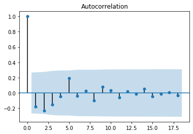


```python
## Check for Linearity of the residuals using the Q-Q plot
import pylab
sm.qqplot(est.resid, line = 's')
pylab.show()

## Checking that mean of the residuals is approximately zero
mean_residuals = sum(est.resid)/len(est.resid)
mean_residuals
```


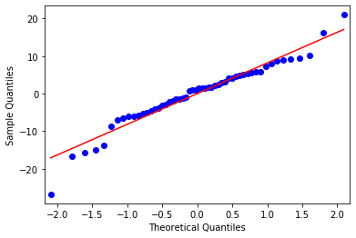


    -1.7829359388054364e-14


```python
## Model summary
print(est.summary())
```

                                OLS Regression Results                            
    ==============================================================================
    Dep. Variable:                   CNCS   R-squared:                       0.589
    Model:                            OLS   Adj. R-squared:                  0.481
    Method:                 Least Squares   F-statistic:                     5.462
    Date:                Wed, 21 Oct 2020   Prob (F-statistic):           2.50e-05
    Time:                        01:56:00   Log-Likelihood:                -190.05
    No. Observations:                  54   AIC:                             404.1
    Df Residuals:                      42   BIC:                             428.0
    Df Model:                          11                                         
    Covariance Type:            nonrobust                                         
    ==============================================================================
                     coef    std err          t      P>|t|      [0.025      0.975]
    ------------------------------------------------------------------------------
    const          6.7159      8.416      0.798      0.429     -10.269      23.701
    ICU            0.0080      0.003      3.050      0.004       0.003       0.013
    PLUF           0.1181      0.656      0.180      0.858      -1.206       1.442
    POPD           0.0103      0.007      1.466      0.150      -0.004       0.025
    HUMI           0.0073      0.191      0.038      0.970      -0.378       0.392
    UNEM           0.6344      0.549      1.156      0.254      -0.473       1.742
    MEDA           0.1111      0.279      0.399      0.692      -0.451       0.673
    ADEP          -0.2184      0.265     -0.824      0.414      -0.753       0.316
    ATEM           0.4171      0.247      1.688      0.099      -0.081       0.916
    APRE          -0.0048      0.124     -0.039      0.969      -0.255       0.246
    CIGA          -0.1614      0.507     -0.318      0.752      -1.185       0.862
    OBES           0.3678      0.410      0.897      0.375      -0.460       1.195
    ==============================================================================
    Omnibus:                        7.383   Durbin-Watson:                   2.334
    Prob(Omnibus):                  0.025   Jarque-Bera (JB):                7.595
    Skew:                          -0.560   Prob(JB):                       0.0224
    Kurtosis:                       4.457   Cond. No.                     3.87e+03
    ==============================================================================
    
    Warnings:
    [1] Standard Errors assume that the covariance matrix of the errors is correctly specified.
    [2] The condition number is large, 3.87e+03. This might indicate that there are
    strong multicollinearity or other numerical problems.
    


```python

```


```python

```


```python
#### Building the model ####
## considering MRAT as our dependent Variable ##
## define our input variable and our output variable where ###
x = covid19_after.drop(['CNCS', 'MRAT'], axis = 1)
y = covid19_after['MRAT']
```


```python
## Split dataset into training and testing portion
from sklearn.model_selection import train_test_split
import numpy as np

x_train, x_test, y_train, y_test = train_test_split(x, y, test_size = 0.30, random_state = 1)

## Scale the independent variables gives
from sklearn.preprocessing import MinMaxScaler
from sklearn import preprocessing
import numpy as np

min_max_scaler= preprocessing.MinMaxScaler()
x_train_minmax = min_max_scaler.fit_transform(x_train)
x_test_minmax = min_max_scaler.fit_transform(x_test)
```


```python
x_train = x_train_minmax
x_test= x_test_minmax
```


```python
## Create an instance of our model
regression_model = LinearRegression()

## Fit the model
regression_model.fit(x_train, y_train)
```


    LinearRegression(copy_X=True, fit_intercept=True, n_jobs=None, normalize=False)


```python
## Getting multiple prediction
y_predict = regression_model.predict(x_test)
## Show the first five
y_predict[:5]
```


    array([1.11697455, 0.56256124, 1.05272564, 0.80999288, 2.50372713])


```python
## Evaluating the model
import statsmodels.api as sm
from statsmodels.stats import diagnostic as diag
from statsmodels.stats.outliers_influence import variance_inflation_factor

## Define our input variable
x2 = sm.add_constant(x)

## Create an OLS model
model = sm.OLS(y, x2)
## fit the data
est = model.fit()
```


```python
## Testing the Model Assumptions
# Heteroscedasticity using the Breusch-Pegan test
#H0:σ2=σ2
#H1:σ2!=σ2

## Grab the p-values
_, pval, _, f_pval = diag.het_breuschpagan(est.resid, est.model.exog)
print(pval, f_pval)
print('_'*100)
if pval > 0.05:
    print("For the Breusch Pagan's Test")
    print("The p-value was {:.4}".format(pval))
    print("we fail to reject the null hypothesis, and conclude that there is no heteroscedasticity.")
else:
    print("For the Breusch Pagan's Test")
    print("The p-value was {:.4}".format(pval))
    print("we reject the null hypothesis, and conclude that there is heteroscedasticity.")
```

    0.19496889194734351 0.19445491270187962
    ____________________________________________________________________________________________________
    For the Breusch Pagan's Test
    The p-value was 0.195
    we fail to reject the null hypothesis, and conclude that there is no heteroscedasticity.
    


```python
### Checking for Autocorrelation using the Ljungbox test
#H0: The data are random
#H1: The data are not random
## Calculate the lag
lag = min(10, (len(x)//5))
print('The number of lags will be {}'.format(lag))
print('_'*100)

## Perform the test
test_results = diag.acorr_ljungbox(est.resid, lags = lag)
## print the result for the test
print(test_results)

## Grab the P-Value and the test statistics
ibvalue, p_val = test_results

## print the result for the test
if min(p_val) > 0.05:
    print("The lowest p-value found was {:.4}".format(min(p_val)))
    print("we fail to reject the null hypothesis, and conclude that there is no Autocorrelation.")
    print('_'*100)
else:
    print("The lowest p-value found was {:.4}".format(min(p_val)))
    print("we reject the null hypothesis, and conclude that there is Autocorrelation.")
    print('_'*100)
      
## Plotting Autocorrelation
import matplotlib.pyplot as plt
from scipy import stats
import statsmodels.api as sm
from statsmodels.stats import diagnostic as diag
sm.graphics.tsa.plot_acf(est.resid)
plt.show()
```

    The number of lags will be 10
    ____________________________________________________________________________________________________
    (array([0.95212652, 2.00227003, 2.20090099, 2.20273294, 2.38205494,
           2.39558071, 3.26256125, 4.64234634, 4.73793016, 5.26275146]), array([0.3291786 , 0.36746213, 0.53177093, 0.69852896, 0.79414346,
           0.87996593, 0.85969769, 0.79502865, 0.85652907, 0.87294901]))
    The lowest p-value found was 0.3292
    we fail to reject the null hypothesis, and conclude that there is no Autocorrelation.
    ____________________________________________________________________________________________________
    

    C:\Users\AGYEMANG ERIC\anaconda3\lib\site-packages\statsmodels\stats\diagnostic.py:524: FutureWarning: The value returned will change to a single DataFrame after 0.12 is released.  Set return_df to True to use to return a DataFrame now.  Set return_df to False to silence this warning.
      warnings.warn(msg, FutureWarning)
    


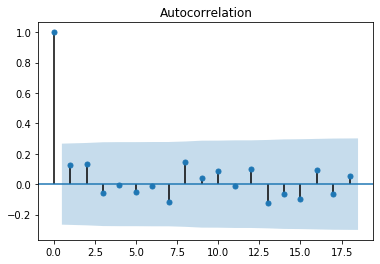


```python
## Check for Linearity of the residuals using the Q-Q plot
import pylab
sm.qqplot(est.resid, line = 's')
pylab.show()

## Checking that mean of the residuals is approximately zero
mean_residuals = sum(est.resid)/len(est.resid)
mean_residuals
```


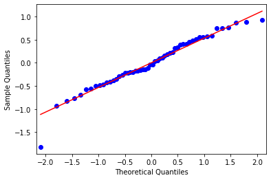


    -1.0392921091629937e-15


```python
## Model summary
print(est.summary())
```

                                OLS Regression Results                            
    ==============================================================================
    Dep. Variable:                   MRAT   R-squared:                       0.413
    Model:                            OLS   Adj. R-squared:                  0.259
    Method:                 Least Squares   F-statistic:                     2.688
    Date:                Wed, 21 Oct 2020   Prob (F-statistic):             0.0104
    Time:                        02:05:03   Log-Likelihood:                -42.660
    No. Observations:                  54   AIC:                             109.3
    Df Residuals:                      42   BIC:                             133.2
    Df Model:                          11                                         
    Covariance Type:            nonrobust                                         
    ==============================================================================
                     coef    std err          t      P>|t|      [0.025      0.975]
    ------------------------------------------------------------------------------
    const          1.0834      0.549      1.972      0.055      -0.025       2.192
    ICU           -0.0002      0.000     -1.011      0.318      -0.001       0.000
    PLUF           0.0204      0.043      0.476      0.636      -0.066       0.107
    POPD           0.0012      0.000      2.538      0.015       0.000       0.002
    HUMI           0.0068      0.012      0.544      0.589      -0.018       0.032
    UNEM           0.0370      0.036      1.033      0.308      -0.035       0.109
    MEDA           0.0009      0.018      0.049      0.961      -0.036       0.038
    ADEP          -0.0159      0.017     -0.921      0.362      -0.051       0.019
    ATEM          -0.0068      0.016     -0.423      0.675      -0.039       0.026
    APRE           0.0028      0.008      0.351      0.727      -0.014       0.019
    CIGA           0.0036      0.033      0.109      0.914      -0.063       0.070
    OBES          -0.0153      0.027     -0.570      0.572      -0.069       0.039
    ==============================================================================
    Omnibus:                        5.327   Durbin-Watson:                   1.727
    Prob(Omnibus):                  0.070   Jarque-Bera (JB):                4.325
    Skew:                          -0.544   Prob(JB):                        0.115
    Kurtosis:                       3.859   Cond. No.                     3.87e+03
    ==============================================================================
    
    Warnings:
    [1] Standard Errors assume that the covariance matrix of the errors is correctly specified.
    [2] The condition number is large, 3.87e+03. This might indicate that there are
    strong multicollinearity or other numerical problems.
    


```python

```


```python

```
